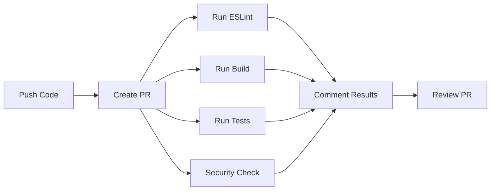

# Playwright Testing Setup - Hướng dẫn sử dụng

## 📋 Giới thiệu

Hệ thống tự động kiểm tra lỗi (defect detection) sẽ chạy mỗi khi bạn tạo Pull Request trên GitHub. Hệ thống bao gồm:

- ✅ **ESLint Check**: Kiểm tra code style và lỗi cú pháp
- ✅ **Build Check**: Đảm bảo TypeScript compile thành công
- ✅ **Playwright Tests**: Chạy tests tự động cho API
- ✅ **Security Audit**: Kiểm tra các lỗ hổng bảo mật

## 🚀 Cách sử dụng

### 1. Chạy tests local (trước khi push)

```bash
# Chạy tất cả tests
npm test

# Chạy tests với UI mode (debug dễ hơn)
npm run test:ui

# Chạy tests ở chế độ debug
npm run test:debug

# Xem report sau khi chạy tests
npm run test:report
```

### 2. Tạo Pull Request trên GitHub

Khi bạn push code lên GitHub và tạo Pull Request, hệ thống sẽ tự động:

1. ✅ Kiểm tra code với ESLint
2. ✅ Build TypeScript code
3. ✅ Chạy Playwright tests
4. ✅ Kiểm tra security vulnerabilities
5. 💬 Comment kết quả vào Pull Request

## 📁 Cấu trúc thư mục

```
.
├── .github/
│   └── workflows/
│       ├── pr-checks.yml      # Workflow chạy khi tạo PR
│       └── deploy.yml         # Workflow deploy
├── src/
│   ├── tests/
│   │   └── api.spec.ts       # Playwright API tests
│   └── load-test.js          # Load testing script
├── playwright.config.ts       # Playwright configuration
└── package.json
```

## ✍️ Viết tests mới

Tạo file mới trong thư mục `src/tests/`:

```typescript
import { test, expect } from '@playwright/test';

test.describe('My Feature Tests', () => {
  test('should work correctly', async ({ request }) => {
    const response = await request.get('/api/v1/my-endpoint');
    expect(response.status()).toBe(200);
  });
});
```

## 🔧 Cấu hình

### Environment Variables

Tạo file `.env` để cấu hình:

```env
API_BASE_URL=http://localhost:3000
```

### GitHub Secrets

Đảm bảo các secrets sau đã được cấu hình trong GitHub repository:
- `HOST`: Server host
- `USERNAME`: Server username
- `PASSWORD`: Server password

## 📊 Xem kết quả tests

### Trong GitHub:
1. Vào Pull Request
2. Xem tab "Checks"
3. Xem comments tự động từ bot

### Trong local:
```bash
npm test
npm run test:report
```

## 🐛 Debug tests

```bash
# Chạy một test cụ thể
npx playwright test api.spec.ts

# Chạy test với browser hiển thị
npx playwright test --headed

# Chạy test ở chế độ debug với breakpoint
npx playwright test --debug
```

## 📚 Tài liệu tham khảo

- [Playwright Documentation](https://playwright.dev)
- [GitHub Actions Documentation](https://docs.github.com/actions)
- [TypeScript ESLint](https://typescript-eslint.io)

## 💡 Tips

- Chạy `npm test` trước khi tạo Pull Request
- Xem report để hiểu rõ lỗi
- Sử dụng `test:ui` để debug dễ hơn
- Thêm tests cho các API endpoints mới

## 🔄 Workflow Process


